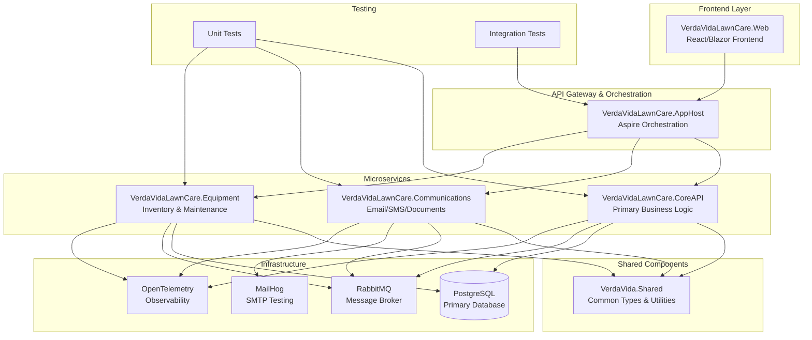

# VerdaVidaLawnCare - Comprehensive Development Plan

## Project Overview

VerdaVidaLawnCare is a modern, microservices-based lawn care management system built with .NET 9, Aspire orchestration, and a comprehensive observability stack. The system is designed to handle lawn care business operations including customer management, equipment tracking, service scheduling, and communications.

## Current Architecture Status

### ✅ Completed Components
- **VerdaVida.Shared**: Common library with Result pattern, exceptions, and utilities
- **VerdaVidaLawnCare.AppHost**: Aspire orchestration with PostgreSQL, RabbitMQ, and MailHog
- **VerdaVidaLawnCare.CoreAPI**: Basic API with Entity Framework, OpenTelemetry, and Serilog
- **Infrastructure**: PostgreSQL database, RabbitMQ messaging, MailHog SMTP testing

### 🚧 In Progress
- CoreAPI entity models and business logic
- Database schema and migrations
- Service integration and communication

### ❌ Not Started
- Communications service
- Equipment service
- Web frontend
- Comprehensive testing suite
- Production deployment configuration

## Architecture Overview

## Development Phases

### Phase 1: Foundation & CoreAPI Enhancement (Weeks 1-2)
**Goal**: Complete the CoreAPI service with comprehensive business logic and data models

#### 1.1 Entity Models & Database Schema
- [ ] **Customer Management**
  - Customer entity with contact information, service preferences
  - Address management for service locations
  - Customer service history and notes
  
- [ ] **Service Management**
  - Service types (mowing, fertilizing, pest control, etc.)
  - Service packages and pricing
  - Service scheduling and availability
  
- [ ] **Property Management**
  - Property details and specifications
  - Service area calculations
  - Property-specific service requirements
  
- [ ] **Appointment & Scheduling**
  - Appointment scheduling system
  - Calendar integration
  - Recurring service management

#### 1.2 Repository Pattern Implementation
- [ ] Generic repository base class
- [ ] Unit of Work pattern
- [ ] Specific repositories for each entity
- [ ] Query optimization and pagination

#### 1.3 Business Logic Services
- [ ] Customer service management
- [ ] Appointment scheduling logic
- [ ] Service pricing calculations
- [ ] Property assessment workflows

#### 1.4 API Controllers & Endpoints
- [ ] RESTful API design
- [ ] Input validation and DTOs
- [ ] Error handling with Result pattern
- [ ] API documentation with Swagger

### Phase 2: Communications Service (Weeks 3-4)
**Goal**: Build comprehensive communications system for customer outreach

#### 2.1 Service Foundation
- [ ] Create Communications service project
- [ ] Configure Aspire integration
- [ ] Set up dependency injection and logging

#### 2.2 Email System
- [ ] Email template management
- [ ] SMTP configuration and testing
- [ ] Email scheduling and queuing
- [ ] Email tracking and analytics

#### 2.3 SMS Integration
- [ ] SMS provider integration (Twilio/AWS SNS)
- [ ] SMS template management
- [ ] SMS scheduling and delivery tracking

#### 2.4 Document Generation
- [ ] Invoice generation
- [ ] Service reports
- [ ] Customer communications
- [ ] PDF generation and storage

#### 2.5 Notification System
- [ ] Event-driven notifications
- [ ] Customer preference management
- [ ] Multi-channel communication orchestration

### Phase 3: Equipment Service (Weeks 5-6)
**Goal**: Build equipment management and maintenance tracking system

#### 3.1 Service Foundation
- [ ] Create Equipment service project
- [ ] Configure Aspire integration
- [ ] Set up database and messaging

#### 3.2 Equipment Management
- [ ] Equipment inventory tracking
- [ ] Equipment specifications and capabilities
- [ ] Equipment location and assignment
- [ ] Equipment lifecycle management

#### 3.3 Maintenance System
- [ ] Maintenance scheduling
- [ ] Maintenance history tracking
- [ ] Parts inventory management
- [ ] Maintenance cost tracking

#### 3.4 Service Integration
- [ ] Equipment availability for appointments
- [ ] Equipment assignment to services
- [ ] Maintenance impact on scheduling

### Phase 4: Web Frontend (Weeks 7-9)
**Goal**: Build modern, responsive web application

#### 4.1 Frontend Foundation
- [ ] Create Web project (React/Blazor)
- [ ] Configure build pipeline and deployment
- [ ] Set up routing and state management

#### 4.2 Customer Portal
- [ ] Customer dashboard
- [ ] Service history and upcoming appointments
- [ ] Payment and billing management
- [ ] Service request and communication

#### 4.3 Admin Dashboard
- [ ] Service management interface
- [ ] Customer management
- [ ] Equipment monitoring
- [ ] Reporting and analytics

#### 4.4 Mobile Responsiveness
- [ ] Mobile-first design
- [ ] Progressive Web App features
- [ ] Offline capability for critical functions

### Phase 5: Integration & Testing (Weeks 10-11)
**Goal**: Comprehensive testing and service integration

#### 5.1 Integration Testing
- [ ] End-to-end service communication
- [ ] Database transaction testing
- [ ] Message queue integration testing
- [ ] External service integration testing

#### 5.2 Performance Testing
- [ ] Load testing for API endpoints
- [ ] Database performance optimization
- [ ] Message queue performance testing
- [ ] Frontend performance optimization

#### 5.3 Security Testing
- [ ] Authentication and authorization testing
- [ ] Data validation and sanitization
- [ ] API security testing
- [ ] Infrastructure security review

### Phase 6: Production Readiness (Weeks 12-13)
**Goal**: Prepare for production deployment

#### 6.1 Production Configuration
- [ ] Environment-specific configurations
- [ ] Secrets management
- [ ] Database migration strategies
- [ ] Monitoring and alerting setup

#### 6.2 Deployment Pipeline
- [ ] CI/CD pipeline configuration
- [ ] Container orchestration (Docker/Kubernetes)
- [ ] Blue-green deployment strategy
- [ ] Rollback procedures

#### 6.3 Documentation & Training
- [ ] User documentation
- [ ] API documentation
- [ ] Deployment guides
- [ ] Troubleshooting guides

## Technical Specifications

### Technology Stack
- **Backend**: .NET 9, ASP.NET Core Web API
- **Database**: PostgreSQL with Entity Framework Core
- **Messaging**: RabbitMQ with MassTransit
- **Frontend**: React/Blazor with TypeScript
- **Orchestration**: .NET Aspire
- **Observability**: OpenTelemetry, Serilog
- **Testing**: xUnit, TestContainers
- **Deployment**: Docker, Kubernetes

### Design Patterns
- **Repository Pattern**: Data access abstraction
- **Unit of Work**: Transaction management
- **CQRS**: Command/Query separation
- **Result Pattern**: Error handling
- **Dependency Injection**: Loose coupling
- **Event-Driven Architecture**: Service communication

### Code Quality Standards
- **C# Guidelines**: Follow .editorconfig and coding standards
- **Database**: PostgreSQL conventions with snake_case naming
- **API**: RESTful design with proper HTTP status codes
- **Error Handling**: Result pattern with structured logging
- **Testing**: Comprehensive unit and integration tests

## Service Responsibilities

### CoreAPI Service
- Customer management and profiles
- Service scheduling and appointments
- Property management and assessments
- Business logic and workflows
- Primary data management

### Communications Service
- Email and SMS communications
- Document generation and delivery
- Customer notification management
- Communication templates and preferences
- Multi-channel communication orchestration

### Equipment Service
- Equipment inventory and tracking
- Maintenance scheduling and history
- Parts inventory management
- Equipment assignment and availability
- Maintenance cost and performance tracking

### Web Frontend
- Customer portal and self-service
- Admin dashboard and management
- Service scheduling interface
- Reporting and analytics
- Mobile-responsive design

## Development Workflow

### Daily Development Process
1. **Start Infrastructure**: `dotnet run --project src/VerdaVidaLawnCare.AppHost/`
2. **Access Dashboard**: Navigate to `https://localhost:15000`
3. **Develop Features**: Work on assigned tasks with proper testing
4. **Run Tests**: Execute unit and integration tests
5. **Code Review**: Submit pull requests for review
6. **Integration**: Merge approved changes

### Testing Strategy
- **Unit Tests**: Test individual components and business logic
- **Integration Tests**: Test service interactions and data flow
- **End-to-End Tests**: Test complete user workflows
- **Performance Tests**: Test system performance under load
- **Security Tests**: Test security vulnerabilities and data protection

### Deployment Strategy
- **Development**: Local development with Aspire orchestration
- **Staging**: Cloud deployment with production-like configuration
- **Production**: Blue-green deployment with monitoring
- **Rollback**: Automated rollback procedures for failed deployments

## Success Metrics

### Technical Metrics
- **Code Coverage**: >90% for business logic
- **API Response Time**: <200ms for 95th percentile
- **Database Query Performance**: <100ms for complex queries
- **Test Execution Time**: <5 minutes for full test suite
- **Deployment Time**: <10 minutes for zero-downtime deployment

### Business Metrics
- **Customer Onboarding**: <5 minutes for new customer registration
- **Service Scheduling**: <30 seconds for appointment booking
- **Communication Delivery**: >99% email/SMS delivery rate
- **Equipment Uptime**: >95% equipment availability
- **System Uptime**: >99.9% service availability

## Risk Mitigation

### Technical Risks
- **Database Performance**: Implement proper indexing and query optimization
- **Message Queue Reliability**: Implement retry policies and dead letter queues
- **Service Dependencies**: Implement circuit breakers and fallback mechanisms
- **Data Consistency**: Use distributed transactions and eventual consistency patterns

### Business Risks
- **Scalability**: Design for horizontal scaling from the start
- **Data Security**: Implement proper encryption and access controls
- **Compliance**: Ensure GDPR and data protection compliance
- **User Experience**: Implement comprehensive error handling and user feedback

## Next Steps

### Immediate Actions (This Week)
1. **Complete CoreAPI Entity Models**: Implement Customer, Service, Property, and Appointment entities
2. **Database Migrations**: Create and test database schema migrations
3. **Repository Implementation**: Build repository pattern for data access
4. **API Controllers**: Create RESTful endpoints for core functionality

### Short-term Goals (Next 2 Weeks)
1. **Communications Service**: Start building the communications microservice
2. **Equipment Service**: Begin equipment management service development
3. **Integration Testing**: Set up comprehensive testing framework
4. **Frontend Planning**: Design and plan the web application architecture

### Long-term Vision (Next 3 Months)
1. **Full System Integration**: Complete all microservices and frontend
2. **Production Deployment**: Deploy to production environment
3. **User Training**: Train end users on system functionality
4. **Performance Optimization**: Optimize system performance and scalability

---

*This plan serves as a living document and will be updated as the project evolves. All team members should refer to this plan for guidance on project direction and priorities.*
